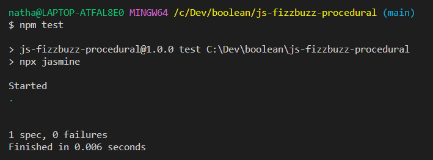
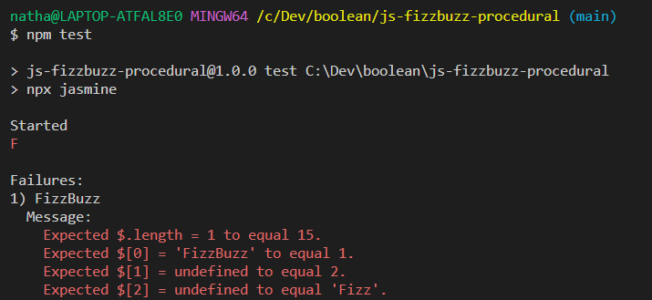

# FizzBuzz

## Setup

1. Fork this repository to your GitHub account
2. Clone your forked repository to your machine
3. Change directory into the project.
4. Install the project dependencies

```sh
$ npm ci
```

## Requirements

Inside the `src/fizzbuzz.js` file, write a program that populates the `answer` array with numbers from 1 to 15, *except*:

- When the number is a multiple of three (e.g. 3, 6, 9, etc.), the number should be replaced with the word `Fizz`

- When the number is a multiple of five (e.g. 5, 10, etc.), the number should be replaced with the word `Buzz`

- When the number is a multiple of both three *and* five (e.g. 15), the number should be replaced with the word `FizzBuzz`

## Testing

- At extremely regular intervals, make predictions about what the code you're writing is actually doing and verify whether you're right or wrong using `console.log`

- A simple test has been created inside
`spec/fizzbuzz.spec.js`. You can look at it, but do not edit this file.

- When you think your solution is correct, run the test by executing the following command in your terminal:

```sh
npm test
```
You'll see a lovely green dot if the test passes successfully:



If the test fails, you'll see a lot of red! Don't worry, we'll learn how to understand error messages like the one below later in the course:

